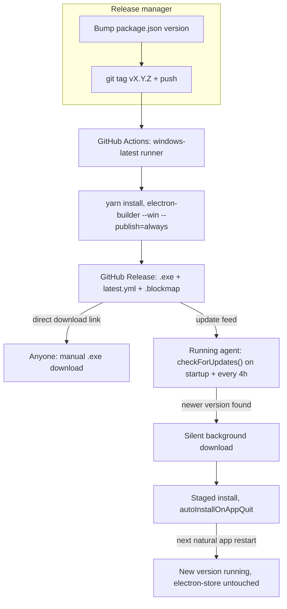

# GitHub Releases Auto-Update - Plan

## Goal Capsule

- **Objective:** Publish the Windows installer as a downloadable GitHub Release and make the running agent auto-update itself from that same release channel, so cashier machines stay current without manual reinstalls.
- **Product authority:** This brainstorm; scope is release publishing + runtime auto-update + the repo hygiene needed to publish cleanly (`.gitignore`, unified README, version fix). macOS/Linux packaging is out of active scope.
- **Open blockers:** None identified; see Outstanding Questions for items to confirm before or during planning.

## Product Contract

### Summary

Add a GitHub Actions release pipeline that builds an unsigned Windows installer and publishes it to GitHub Releases on every version tag, and wire `electron-updater` into the running agent so it silently downloads new versions and installs them on the app's next natural restart. Alongside this, clean up the repo (`.gitignore`, unified `README.md`, corrected `package.json` version) so the first commit and first release start from a clean state.

### Requirements

**Release packaging and versioning**

- R1. `package.json` version is corrected to `1.3.1` before the first tagged release, resolving the drift between the committed version and the installer already built in `dist/`.
- R2. `electron-builder`'s `build.win` config gains a `publish` entry targeting GitHub Releases (provider `github`, owner/repo `mesanube/print-agent`), producing an unsigned NSIS installer.
- R3. The published installer is reachable as a direct download link from the GitHub Releases page, usable independently of whether the requesting machine already runs the agent.

**Auto-update (runtime)**

- R4. `electron-updater` is added and the agent checks for updates against the same GitHub Releases feed on startup and periodically while running.
- R5. Update downloads happen silently in the background and never interrupt an in-progress print job.
- R6. A downloaded update installs automatically the next time the app restarts naturally (app relaunch or machine reboot); the agent never forces a restart or prompts the cashier to confirm.
- R7. Auto-update never alters or wipes `electron-store` state (selected printer, `registerId`, template/logo/QR/cutter config) — installing a new version preserves it exactly as the no-silent-reroute principle in `CLAUDE.md` already requires for any printer-selection-adjacent change.

**CI/CD publish workflow**

- R8. A GitHub Actions workflow triggers on pushing a version tag (e.g. `v1.3.1`), builds the Windows installer, and publishes it to GitHub Releases without a manual local `electron-builder --publish` step.
- R9. Publishing a new release going forward only requires bumping `package.json`'s version and pushing the matching tag.

**Repo hygiene**

- R10. `.gitignore` excludes build/local-state artifacts that must never be committed: `dist/`, `user-data/`, `.DS_Store`, and any other build output already present untracked in the working tree.
- R11. `README.md` and `README2.md` are merged into a single `README.md` that stays the API/UX source of truth, updated to describe the GitHub Releases download link and the auto-update behavior; `README2.md` is removed.

## Key Decisions

- **Windows only for v1** — macOS/Linux auto-update and publish stay out of scope; Windows is where production cashier machines actually run. Governs R2, R3, R4.
- **No code signing for v1** *(session-settled: user-directed — chosen over buying a code-signing certificate now: avoids cost and validation delay; the unsigned NSIS installer still works with `electron-updater`, just shows a Windows SmartScreen warning)* — signing can be added later without changing the update mechanism. Governs R2.
- **Publish via GitHub Actions on tag push** *(session-settled: user-directed — chosen over a manual local `--publish=always` build: reproducible, not tied to one machine)*. Governs R8, R9.
- **Silent install on next natural restart, no forced restart** *(session-settled: user-directed — chosen over forcing a restart after N days pending: simplest for v1, zero risk of interrupting an unattended cashier machine mid-shift; revisit later if updates are found to sit undelivered too long)*. Governs R6.
- **Fix the version drift now rather than carry it forward** *(session-settled: user-directed — `package.json` moves to `1.3.1` to match the installer already built in `dist/`, instead of starting the release pipeline on a version that doesn't match what's already out there)*. Governs R1.
- **Unify the two READMEs as part of this work** *(session-settled: user-directed — `README.md` was already established as the API contract source of truth in `CLAUDE.md`; folding `README2.md` into it now avoids publishing a release pipeline documented in two diverging places)*. Governs R11.

### Actors

- **Release manager (developer)** — bumps the version, pushes the tag, and (indirectly, via CI) triggers the build and publish to GitHub Releases.
- **Running agent instance** — the print-agent process on a cashier's machine; checks for, downloads, and installs updates on its own, without a human present.

### Key Flows

- F1. Release publish
  - **Trigger:** Developer bumps `package.json` version and pushes a matching `vX.Y.Z` git tag.
  - **Actors:** Release manager, GitHub Actions
  - **Steps:** CI checks out the tag, installs deps, runs `electron-builder --win --publish=always`; the NSIS installer and update metadata are uploaded to a new GitHub Release for that tag.
  - **Outcome:** A downloadable `.exe` link exists on GitHub Releases, and `electron-updater`-enabled agents can discover the new version.
  - **Covers:** R2, R3, R8, R9

- F2. Silent auto-update
  - **Trigger:** A running agent's periodic or startup update check finds a newer published version.
  - **Actors:** Running agent instance
  - **Steps:** Agent downloads the new installer in the background; on the next natural app restart, `electron-updater` applies it before the app finishes launching.
  - **Outcome:** The agent is running the new version with all prior `electron-store` state intact; no cashier interaction occurred.
  - **Covers:** R4, R5, R6, R7

### Acceptance Examples

- AE1. **Covers R5.** Given the agent is mid-print when a background update download completes, when the download finishes, then the current print job is unaffected and the update simply waits for the next restart.
- AE2. **Covers R6, R7.** Given a cashier's machine has a printer explicitly selected and a `registerId` set, when the agent restarts after downloading an update, then the new version launches with the same printer selection and `registerId` still active.
- AE3. **Covers R3.** Given someone with no agent installed opens the GitHub Releases page for `mesanube/print-agent`, when they click the latest release's `.exe` asset, then the installer downloads directly, with no agent or account required.

### Scope Boundaries

**Deferred for later**

- macOS and Linux packaging, signing, and auto-update.
- Code signing / notarization for the Windows installer.
- Any forced-restart or "nag after N days pending" mechanism for updates that sit downloaded too long.
- Staged/canary rollout or update rollback strategy.

### Dependencies / Assumptions

- The GitHub repo `mesanube/print-agent` is public, so Release assets are downloadable without authentication and the default `GITHUB_TOKEN` in Actions has sufficient permission to publish releases in the same repo.
- The developer runs `gh`/`git` with push access to `mesanube/print-agent` (confirmed: authenticated as `nandod1707`).

**Product Contract preservation:** unchanged from the `ce-brainstorm` version of this file — no R/A/F/AE IDs were split, renumbered, or reworded. The three items previously listed under "Deferred to Planning" (update-check interval, differential updates, README outline) are resolved below as KTD1, KTD3, and U1's approach, respectively.

---

## Planning Contract

### Key Technical Decisions

- KTD1. **Update checks run on startup, then every 4 hours while the app stays open.** A cashier machine can stay on for days; a startup-only check would leave it running a stale version indefinitely between reboots. Four hours is frequent enough to catch a release within the same shift without adding meaningful load to GitHub's release feed. Governs R4.
- KTD2. **Use `autoUpdater.checkForUpdates()`, not `checkForUpdatesAndNotify()`.** The `AndNotify` variant shows a native OS notification on some platforms once an update is found — that is UI the confirmed silent-update decision rules out. `checkForUpdates()` triggers the same download-and-stage pipeline with zero UI. Governs R5, R6.
- KTD3. **Leave NSIS differential (blockmap) updates on the electron-builder default** rather than disabling them. `electron-builder`'s NSIS target already emits a `.blockmap` file per release when a `publish` block is present, and `electron-updater` uses it automatically to download only the changed bytes. No extra config is needed to get it, and turning it off would only make updates slower and heavier for machines that may be on a shared or limited-bandwidth local network. Governs R2, R4.
- KTD4. **`electron-updater`'s default `autoInstallOnAppQuit: true` is the installation trigger**, not a custom restart-detection module. It already implements exactly the confirmed behavior (apply on the next natural quit/relaunch, never forced) — building a bespoke mechanism would duplicate library behavior for no benefit. Governs R6.
- KTD5. **The updater module never touches `electron-store` directly.** `electron-updater`'s job is limited to downloading and staging the new installer via NSIS; the installer itself does not manage user data files, so `electron-store`'s on-disk file is never in its write path. This is a verification point (AE2), not new code to write. Governs R7.
- KTD6. **GitHub Actions release workflow runs on `windows-latest`.** The NSIS Windows target must be built with the matching native toolchain; building it under Wine on a Linux runner is avoidable complexity for a single-platform release. Governs R8.
- KTD7. **README merge keeps `README.md`'s existing structure as the backbone** (it's the established API contract source of truth per `CLAUDE.md`) and folds `README2.md`'s UX-only content in as additional sections rather than restructuring from scratch, plus a new short section describing the GitHub Releases download link and auto-update behavior. Governs R11.

### High-Level Technical Design

### Sequencing

U1 and U2 have no dependencies and can land first (repo hygiene, then version fix) so the first commit and first tag start clean. U3 depends on U2 (publish config should reference the corrected version). U4 depends on U3 (the updater needs the publish/provider config already present to resolve the feed). U5 depends on U3 and U4 (the CI workflow builds and publishes what U3/U4 produced).

---

## Implementation Units

### U1. Repo hygiene: `.gitignore` and README unification

- **Goal:** Stop build output and local state from being committed, and collapse the two diverging READMEs into one.
- **Requirements:** R10, R11
- **Dependencies:** none
- **Files:**
  - `.gitignore` (modify)
  - `README.md` (modify — becomes the merged, single source of truth)
  - `README2.md` (delete, after folding its content into `README.md`)
- **Approach:**
  1. Add `dist/`, `user-data/`, `.DS_Store`, and `node_modules/` (already present) plus any other currently-untracked build artifact to `.gitignore`.
  2. Read both READMEs fully; keep `README.md`'s structure (per KTD7) and fold in `README2.md`'s UX-only sections (setup walkthrough, troubleshooting-style content) that aren't already covered.
  3. Add a short "Downloads and updates" section to the merged `README.md` describing the GitHub Releases download link and that the agent auto-updates itself (kept generic — don't hardcode a specific release URL that will go stale).
  4. Delete `README2.md`.
- **Patterns to follow:** Existing `CLAUDE.md` guidance that `README.md` is the API contract source of truth; writing rules (no em dashes, no emojis, Spanish only for user-facing UI copy — README prose itself may stay in whichever language the existing `README.md` already uses).
- **Test scenarios:** `Test expectation: none -- repo hygiene and documentation only, no runtime behavior change.`
- **Verification:** `git status` shows `dist/`, `user-data/`, and `.DS_Store` no longer listed as trackable; only one `README.md` exists in the repo root.

### U2. Fix `package.json` version drift

- **Goal:** Correct the committed version to match the intended first release.
- **Requirements:** R1
- **Dependencies:** none (can land alongside U1)
- **Files:** `package.json` (modify)
- **Approach:** Change `"version": "1.3.0"` to `"version": "1.3.1"`.
- **Test scenarios:** `Test expectation: none -- single field change.`
- **Verification:** `node -p "require('./package.json').version"` prints `1.3.1`.

### U3. Add GitHub Releases publish config to `electron-builder`

- **Goal:** Make `electron-builder`'s Windows build target GitHub Releases as its publish destination.
- **Requirements:** R2, R3
- **Dependencies:** U2
- **Files:** `package.json` (modify — `build.publish` and/or `build.win.publish`)
- **Approach:**
  1. Add a `publish` entry under `build` (or scoped under `build.win`) with `provider: "github"`, `owner: "mesanube"`, `repo: "print-agent"`.
  2. Leave `build.win.target: "nsis"` as-is; no code-signing fields are added (per the no-signing Key Decision).
  3. Do not change the existing `dist*` scripts (`--publish=never`) — publishing is CI's job (U5), not local dev builds.
- **Patterns to follow:** Existing `build` block shape in `package.json`.
- **Test scenarios:** `Test expectation: none -- build configuration only; validated via a local unpublished build (see Verification).`
- **Verification:** `yarn dist` (which passes `--publish=never`) still completes and produces `dist/Mesanube Impresora Setup 1.3.1.exe` without attempting to reach GitHub.

### U4. Wire `electron-updater` into the running agent

- **Goal:** The agent checks for, silently downloads, and stages updates without any UI or forced restart.
- **Requirements:** R4, R5, R6, R7
- **Dependencies:** U3
- **Files:**
  - `package.json` (modify — add `electron-updater` dependency)
  - `src/core/auto-updater.js` (new)
  - `src/main.js` (modify — call the new module during startup)
- **Approach:**
  1. Add `electron-updater` to `dependencies`.
  2. Create `src/core/auto-updater.js` exporting `initAutoUpdater()`: configure `autoUpdater.autoDownload = true`, `autoUpdater.autoInstallOnAppQuit = true` (both are library defaults, set explicitly for clarity per KTD4), attach `[Update]`-prefixed log listeners (`checking-for-update`, `update-available`, `update-not-available`, `error`, `download-progress`, `update-downloaded`) matching the repo's existing `console.log("[Component] ...")` convention, call `autoUpdater.checkForUpdates()` once, then `setInterval(() => autoUpdater.checkForUpdates(), 4 * 60 * 60 * 1000)` (KTD1).
  3. In `src/main.js`, import and call `initAutoUpdater()` inside the existing `app.whenReady().then(...)` block, after `autoSelectPrinter()` so it doesn't delay startup-critical printer detection, and only when `app.isPackaged` is true (skip in `yarn dev`, matching the existing `isDevelopment` check already used for the server).
- **Patterns to follow:** `src/server/index.js`'s `isDevelopment` gating pattern; `console.log("[Component] ...")` logging convention repo-wide.
- **Test scenarios:**
  - `Test expectation: no automated test framework in this repo (see CLAUDE.md); verify manually per the steps below.`
  - Manual: package the app (`yarn dist`), run it, confirm `[Update] checking for update...`-style log lines appear on startup and are not shown in `yarn dev` (unpackaged).
  - Manual: confirm no dialog, tray notification, or window appears at any point during an update check or download (silent-by-design, R5/R6).
  - Manual: with a printer explicitly selected and `registerId` set, install an update build and confirm both persist after relaunch (R7 / AE2) — inspect `electron-store`'s on-disk JSON before and after.
- **Verification:** Startup log shows the update check firing once per session and does not block `GET /status` from responding promptly.

### U5. GitHub Actions release workflow

- **Goal:** Publishing a new release requires only a version bump and a tag push.
- **Requirements:** R8, R9
- **Dependencies:** U3, U4
- **Files:** `.github/workflows/release.yml` (new)
- **Approach:**
  1. Trigger on `push` to tags matching `v*`.
  2. `runs-on: windows-latest` (KTD6).
  3. Steps: checkout, set up Node (matching the Electron 28 / Node version this project targets), `corepack enable` or install Yarn, `yarn install --frozen-lockfile`, then `yarn electron-builder --win --publish=always` (or an equivalent script added to `package.json` if that reads cleaner — implementer's call).
  4. Set the job's `GH_TOKEN`/`GITHUB_TOKEN` env from `secrets.GITHUB_TOKEN`, and grant the workflow `permissions: contents: write` so `electron-builder`'s GitHub publish step can create the release and upload assets.
- **Patterns to follow:** None yet in this repo (`.github/workflows/` does not currently exist) — standard `electron-builder` + GitHub Actions publish recipe.
- **Test scenarios:** `Test expectation: none -- CI configuration; validated via a real tag push (see Verification), not unit tests.`
- **Verification:** Push a `v1.3.1` tag on the release branch and confirm the Actions run completes, and that the `mesanube/print-agent` GitHub Release for that tag has the `.exe`, `latest.yml`, and `.blockmap` assets attached.

---

## Verification Contract

| Unit | Command / Action | Applicability | Done signal |
|---|---|---|---|
| U1 | `git status` | Always | `dist/`, `user-data/`, `.DS_Store` not listed as trackable; only `README.md` present |
| U2 | `node -p "require('./package.json').version"` | Always | Prints `1.3.1` |
| U3 | `yarn dist` | Always | Produces `dist/Mesanube Impresora Setup 1.3.1.exe`; no network call to GitHub |
| U4 | `yarn dev`, then packaged run via `yarn dist` + install | Always | Update-check log line present only in packaged run; no UI shown; `electron-store` state survives an update cycle |
| U5 | `git tag v1.3.1 && git push origin v1.3.1` | Once repo is committed and pushed | GitHub Actions run succeeds; Release page shows `.exe` + `latest.yml` + `.blockmap` |

## Definition of Done

- `.gitignore` excludes `dist/`, `user-data/`, `.DS_Store`; only one `README.md` remains and documents the download/update behavior.
- `package.json` version is `1.3.1` and carries a working `build.publish` GitHub Releases config.
- `electron-updater` is wired into `src/main.js` via `src/core/auto-updater.js`, checking on startup and every 4 hours, downloading silently, and installing only on natural app restart.
- A GitHub Actions workflow at `.github/workflows/release.yml` publishes a tagged build to GitHub Releases without a manual local publish step.
- A cashier machine's `electron-store` state (printer selection, `registerId`, template/logo/QR/cutter config) is confirmed intact across a manual update-and-restart test (AE2).
- The first commit to `mesanube/print-agent` happens after U1 and U2 land, so the initial repo history starts from the cleaned-up state rather than carrying the current untracked `dist/`/version drift forward.
